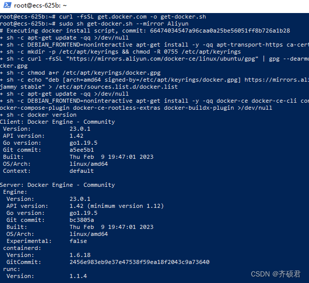

## 引言

最近使用VPS搭建SSR节点时，发现并不是每个linux发行版都能够基于此教程成功安装SSR服务端，比如我基于Ubuntu 22.04安装时遇到**[Error] Failed to install python**问题，恰巧我最近刚接触学习Docker，便有了把搭建好的SSR节点环境打包成Docker镜像的想法。优点：**通过docker一键部署让你可以避免SSR安装中的一些问题。**

参考文章：[zhaoweih/Shadowsocks-Tutorial: 🐱给小白的Shadowsocks和V2ray翻墙教程 (github.com)](https://github.com/zhaoweih/Shadowsocks-Tutorial)

## 购买VPS服务器

参考这[教程](https://github.com/zhaoweih/Shadowsocks-Tutorial)完成服务器的购买，并成功连接服务器（通过powershell或Xshell），到**安装ss**这个步骤停住、回来。

## 安装Docker

为了一键部署SSR服务器，首先要安装Docker，网上的教程比较多，我这提供一个最简的安装命令:

```powershell
# 使用curl工具下载脚本自动安装
curl -fsSL get.docker.com -o get-docker.sh
sudo sh get-docker.sh --mirror Aliyun
# 启动Docker
sudo systemctl enable docker
sudo systemctl start docker
# 测试是否安装成功
sudo docker run --rm hello-world
```



## 下载SSR镜像并启动容器

我基于centos7安装了SSR，并将它打包为[Docker镜像](https://hub.docker.com/r/yinqishuo/ssr/tags)，你仅需按照如下指令安装

```powershell
# 下载SSR镜像 并配置主机端口20000映射到容器20000，容器命名为为ssr
docker run -idt --name ssr  -p 20000:20000 yinqishuo/ssr:0.01  
# 启动shadowsocks 
docker exec -d ssr /bin/python /usr/local/shadowsocks/server.py -c /etc/shadowsocks-r/config.json -d start
# 查看容器是否启动成功
docker ps
```

查看启动的SSR服务器端容器


## 配置客户端

假设你已经按照这[教程](https://github.com/zhaoweih/Shadowsocks-Tutorial)成功安装好了客户端，你只需要在SSR客户端配置时可以填写如下参数（因为需要打包镜像，所以我把SSR服务器的参数设置为**固定值**）：


shadowsocks有3个模式：直连、PAC和全局模式：

直连就是相当于关闭代理，PAC（Proxy Auto Config）模式就是根据特定规则适使用代理或者直接访问，全局模式就是全部流量都是用代理。

常规的设置是：**PAC模式（绕过局域网和大陆）**

## 配置好之后就可以科学上网了


如果对你有用，麻烦点个Star鼓励一下作者。

## 自定义SSR服务端参数

为了安装便捷，我直接预设了SSR服务端的参数（密码、加密方式、混淆方式等），但是肯定有人不满足与此，想要自定义参数，方法如下：

```powershell
# 以命令行方式进入SSR容器内部 
docker exec -it ssr /bin/bash
# 编辑配置文件
vi /etc/shadowsocks-r/config.json
# 启动shadowsocks
python /usr/local/shadowsocks/server.py -c /etc/shadowsocks-r/config.json -d start
# 按下此按钮组合退出容器
Ctrl+P+Q 
```

配置文件的内容如下：


容器内启动shadowsocks成功结果：


